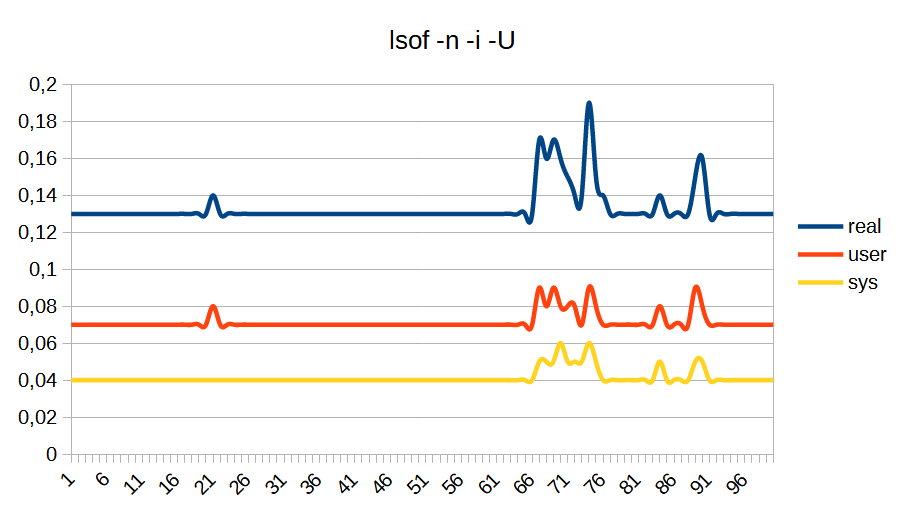
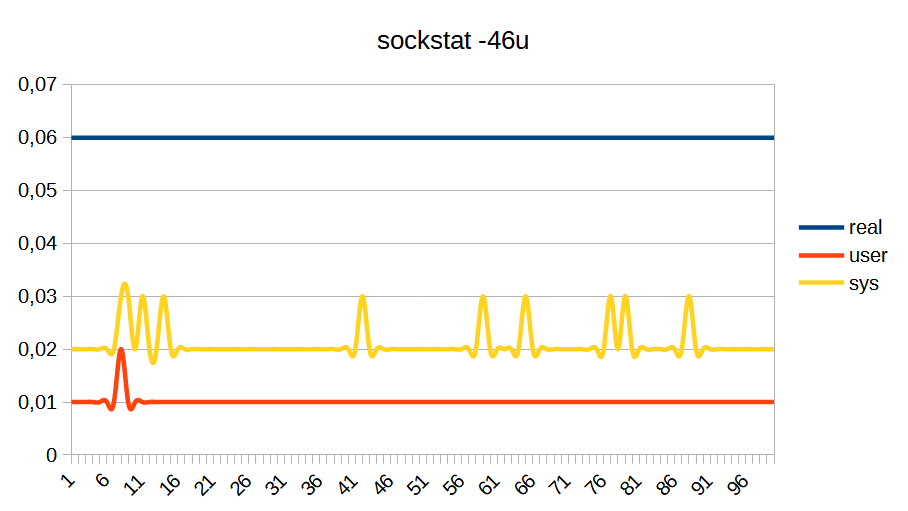

# Sockstat for macOS

[](https://github.com/mezantrop/sockstat/actions/workflows/codeql.yml)
[](https://github.com/mezantrop/sockstat/actions/workflows/c-cpp-macos.yml)

## FreeBSD-like sockstat for macOS using libproc

<a href="https://www.buymeacoffee.com/mezantrop" target="_blank"></a>


### Download

See releases and [Download](https://github.com/mezantrop/sockstat/releases) a precompiled universal binary

### Build from sources

You can compile everything from sources. To install `sockstat` into `bin` directory under `/usr/local`, run:

```sh
make install clean
```

If a custom installation path, define `PREFIX`:

```sh
make install clean PREFIX=/path/to/install
```

To build a universal binary suitable both for x64 and M-processors:

```sh
make universal install clean
```

To deinstall:

```sh
make uninstall
```

### Usage

```
sockstat-1.0.1

Usage:
    sockstat [-46klNrquh]

    -4  Show AF_INET (IPv4) sockets
    -6  Show AF_INET (IPv6) sockets
    -k  Show AF_SYSTEM (Kernel) sockets
    -n  Show AF_NDRV sockets
    -r  Show AF_ROUTE sockets
    -u  Show AF_LOCAL (UNIX) sockets

    -l  Show only LISTENing sockets
    -q  Quiet mode - suppress header

    -h  This help message
```

### Performance

I do not think, performance plays here any role, but anywhy: the same good old MacBook Air late 2015, idle state.
Graphs `lsof` vs `sockstat` - the lower, the better.

 

If you have an idea, a question, or found a problem, do not hesitate to open an
[issue](https://github.com/mezantrop/sockstat/issues) or mail me: Mikhail Zakharov <zmey20000@yahoo.com>
