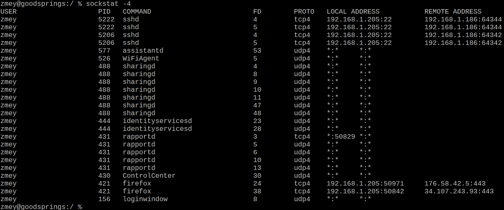

# Sockstat for macOS

## FreeBSD-like sockstat for macOS using libproc

Warning! This is still beta version!

If you have an idea, a question, or have found a problem, do not hesitate to open an issue or
mail me: Mikhail Zakharov <zmey20000@yahoo.com>
